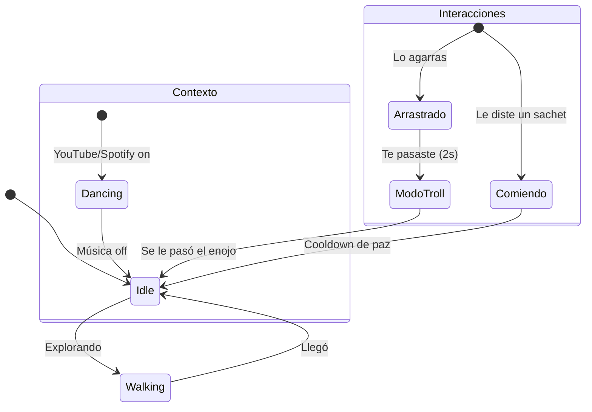
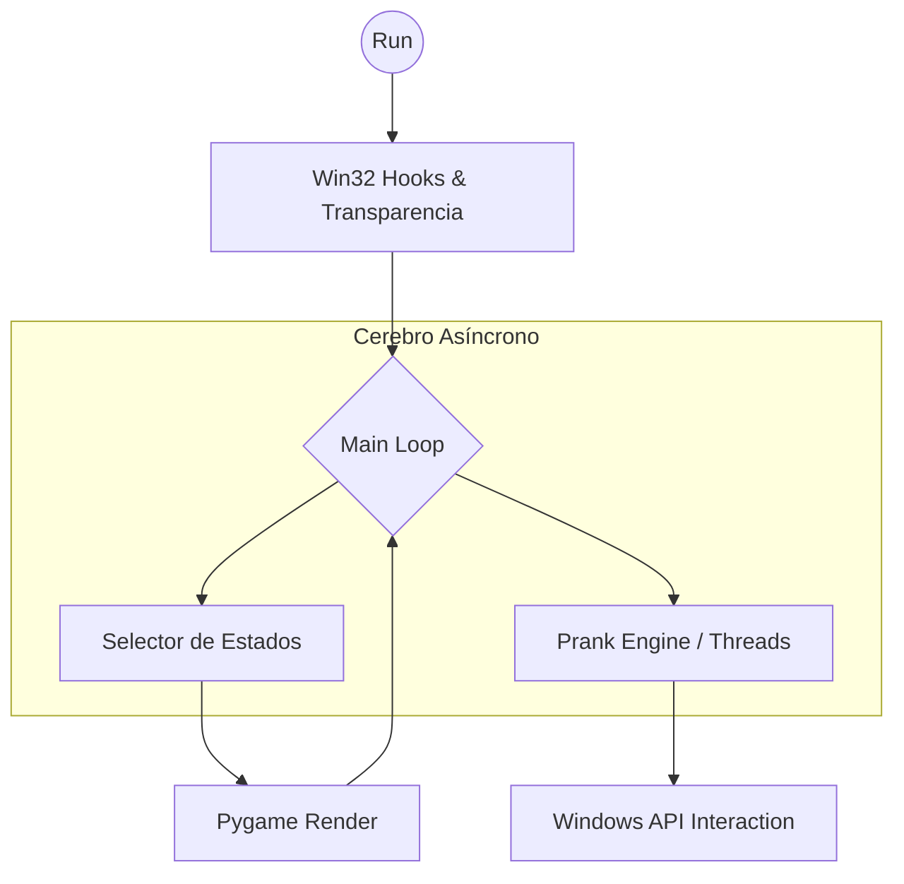

# 🐱 Pudin: The Ghost Cat RPA

  

  

Sinceramente, **Pudin** nació porque quería una mascota de escritorio, pero terminó siendo un agente de automatización con problemas de actitud. Es un gato que vive en tu pantalla, camina sobre tus ventanas y, si te descuidas, te hackea un poquito el día.

No es el típico gato que solo se queda ahí mirando. Pudin usa la Win32 API para "romper" tu escritorio, detecta qué estás escuchando y tiene un sistema de **Pomodoro Inverso**: si trabajas mucho, él decide que ya fue suficiente y te manda un Rickroll o te escribe tonterías en el Notepad.

---

## ✨ Lo que hace Pudin

* **🕺 Melómano:** Si ve que tienes YouTube o Spotify abierto, se pone a bailar. Es su forma de decirte que tienes buen gusto.
* **👿 Modo Troll:** No lo agarres mucho tiempo. Si lo arrastras más de la cuenta, se enoja, se pone "glitchy" y te secuestra el mouse un rato.
* **🍱 El soborno es la clave:** Si te está molestando demasiado con sus "maldades", tírale un sachet de comida (tecla F). Eso le da 2 minutos de paz a tu sistema.
* **🧠 Tiene "cerebro":** No sigue un camino fijo. Decide si quiere seguir tu mouse, vagar por ahí o simplemente tirarse a dormir en la barra de tareas.

---

## 🛠️ La parte técnica (Lo que hay bajo el capó)

Si te interesa el código, aquí es donde la cosa se pone seria. Pudin es básicamente un experimento de **RPA (Robotic Process Automation)** y manipulación de bajo nivel de Windows.

### 1. ¿Cómo se mueve? (FSM)

Usa una **Máquina de Estados Finitos**. Básicamente, un cerebro que evalúa probabilidades y prioridades: si hay comida, va por ella; si lo arrastras, se enoja; si no pasa nada, decide si caminar o dormir.

### 2. El motor de "Maldades" (RPA Engine)

Aquí es donde entra la magia negra de Windows. Para no congelar la animación del gato mientras hace sus travesuras, todo corre en hilos separados (**Multithreading**).

| Truco | Cómo lo hace |
| --- | --- |
| **Transparencia** | Usa `WS_EX_LAYERED` para que el gato no tenga un recuadro feo alrededor. |
| **Window Shaker** | Agarra el `HWND` de tu ventana activa y la sacude usando `SetWindowPos`. |
| **Ghost Typing** | Abre un Notepad, busca la ventana y tipea usando `pyautogui`. |
| **Wallpaper** | Se mete con `SystemParametersInfoW` para cambiarte el fondo apenas abre. |

### 3. Arquitectura General

El flujo de datos se ve así, separando el renderizado de la toma de decisiones:

---

## 📂 ¿Qué hay en cada archivo?

* **`main.py`**: El orquestador. Configura la ventana y corre el bucle de 60 FPS.
* **`pudin.py`**: Toda la lógica del gato. Sus estados, animaciones y reacciones.
* **`utils.py`**: El "brazo armado". Maneja la Win32 API, los sonidos y las inyecciones de código.
* **`effects.py`**: Lo visual. Las huellas neón y los brillitos estilo cyberpunk.

---

## 🔧 Setup rápido

1. **Clona esto:** `git clone https://github.com/KaledSML/Pudin-Ghost-Cat-RPA.git`
2. **Librerías:** Necesitas `pygame`, `pyautogui` y `pywin32`.
3. **Dale play:** `python main.py` (Solo funciona en Windows, obviamente).

---

**Desarrollado con 🐾 por [KaledSML**](https://github.com/KaledSML) *"Menos código perfecto, más gatos que hackean."*

---
