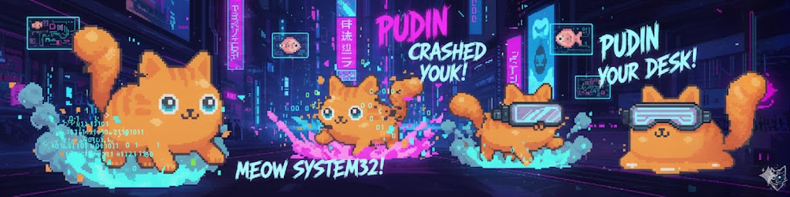
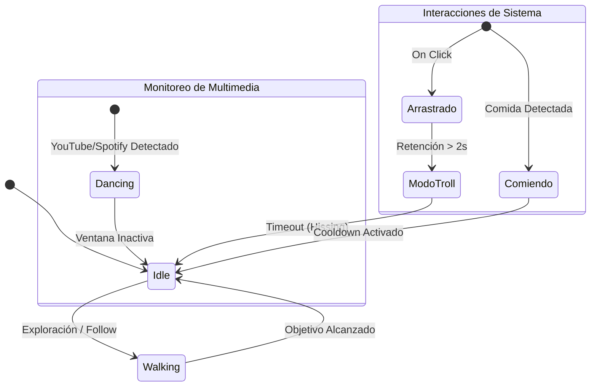
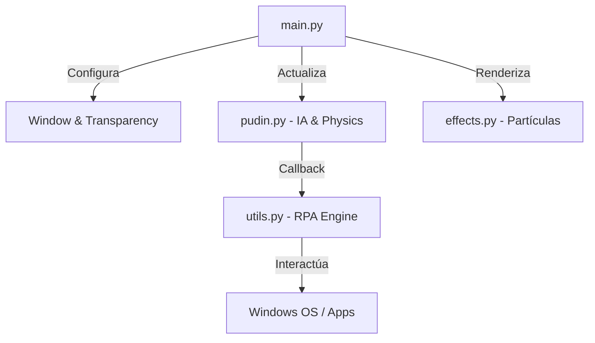

# 🐱 Pudin: The Ghost Cat RPA

<p align="center">

</p>

**Pudin** es una mascota virtual interactiva que vive en tu escritorio, diseñada con capacidades de **RPA (Robotic Process Automation)**. No es solo un adorno; es un agente autónomo que monitorea tu actividad, reacciona a tu música y, si te excedes trabajando, te obliga a tomar un descanso mediante "maldades" programadas.

---

## ✨ Características Principales

* **🕺 Detección de Contexto:** Analiza los títulos de las ventanas activas. Si detecta Spotify o YouTube, entra en modo `dance`.
* **👿 Sistema de Pranks (RPA):** Ejecuta acciones asíncronas como sacudir ventanas, minimizar aplicaciones o abrir el Notepad para escribir mensajes.
* **🧠 IA Basada en FSM:** Su comportamiento no es lineal. Decide entre seguir al usuario, vagar aleatoriamente o dormir basándose en probabilidades.
* **🍱 Mecánica de Soborno:** El usuario puede calmar a Pudin usando la tecla `F` o clic derecho para dejar comida, lo que resetea su contador de agresividad.

---

## 🛠️ Deep Dive Técnico

### 1. Máquina de Estados Finitos (FSM)

La lógica de Pudin se gestiona mediante estados que definen tanto su animación como su comportamiento físico.



### 2. Integración con Windows (Win32 API)

Para lograr la transparencia y la interacción con el SO, el proyecto utiliza `pywin32` y `ctypes`:

* **Layered Windows:** Se utiliza `WS_EX_LAYERED` y `LWA_COLORKEY` para eliminar el fondo de la ventana de Pygame y permitir que el mouse "atraviese" las zonas transparentes.
* **Multithreading:** Las "maldades" (como el `ghost_typing`) se ejecutan en hilos *daemon* para evitar que la interfaz del gato se congele mientras el script manipula el SO.
* **RPA Engine:** Usa `SetWindowPos` para manipular el `HWND` de ventanas externas y `pyautogui` para la inyección de input.

### 3. Arquitectura de Software

El flujo sigue un patrón de desacoplamiento donde el `main.py` solo orquesta, mientras que la lógica pesada reside en módulos especializados.



---

## 📂 Estructura de Archivos

* **`main.py`**: Punto de entrada. Gestiona el bucle de 60 FPS y los eventos de mouse.
* **`pudin.py`**: El cerebro del agente. Contiene la lógica de la FSM y el sistema Pomodoro.
* **`utils.py`**: El motor de automatización. Carga recursos y ejecuta las interacciones con la Win32 API.
* **`effects.py`**: Sistema de partículas para las huellas neón y brillitos cyberpunk.

---

## 🔧 Instalación y Setup

1. **Clonar repositorio:**
```bash
git clone https://github.com/KaledSML/Pudin-Ghost-Cat-RPA.git
cd Pudin-Ghost-Cat-RPA

```


2. **Instalar dependencias:**
```bash
pip install -r requirements.txt

```


3. **Ejecutar:**
```bash
python main.py

```


---

**Desarrollado con 🐾 por [KaledSML**](https://github.com/KaledSML)
*"Menos código aburrido, más gatos que hackean."*

---
