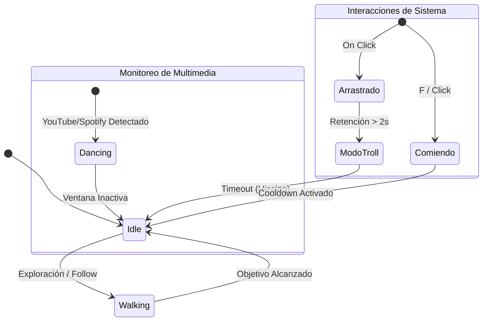

# 🐱 Pudin: The Ghost Cat RPA

<p align="center">

</p>

<p align="center">
  <a href="https://www.youtube.com/@TU_CANAL_AQUI">
    
  </a>
</p>

**Pudin** es una mascota virtual interactiva que vive en tu escritorio, diseñada con capacidades de **RPA (Robotic Process Automation)**. No es solo un adorno; es un agente autónomo que monitorea tu actividad, reacciona a tu música y, si te excedes trabajando, te obliga a tomar un descanso mediante "maldades" programadas.

---

## 🎮 Manual de Supervivencia (Controles)

| Acción | Comando / Input | Resultado en Pudin |
| :--- | :--- | :--- |
| **Mimir** | Tecla `P` | Entra en modo pausa, se sienta y se queda dormidito. |
| **Alimentar** | Tecla `F` o Clic Izq | Aparece un sachet de comida para calmar su agresividad. |
| **Moverlo** | Clic Izquierdo (Hold) | Puedes arrastrarlo, pero se quejará si lo retienes mucho tiempo. |
| **Molestarlo** | Clic Derecho | Pudin soltará un chillido (**Hiss**) de indignación. |
| **Desterrarlo** | Tecla `ESC` | Cierra el programa y libera tu sistema. |

---

## ✨ Características Principales

* **🕺 Detección de Contexto:** Analiza los títulos de las ventanas activas. Si detecta Spotify o YouTube, entra en modo `dance`.
* **👿 Sistema de Pranks (RPA):** Ejecuta acciones asíncronas como sacudir ventanas, minimizar aplicaciones o abrir el Notepad para escribir mensajes.
* **🧠 IA Basada en FSM:** Su comportamiento no es lineal. Decide entre seguir al usuario, vagar aleatoriamente o dormir basándose en probabilidades.
* **🍱 Mecánica de Soborno:** Alimentar a Pudin resetea su contador de agresividad, dándote minutos de paz.

---

## 🛠️ Deep Dive Técnico

### 1. Máquina de Estados Finitos (FSM)



### 2. Integración con Windows (Win32 API)

* **Layered Windows:** Usa `WS_EX_LAYERED` para transparencia total y clic-through en áreas vacías.
* **Multithreading:** Las maldades como el `ghost_typing` corren en hilos *daemon* para no congelar la animación.
* **RPA Engine:** Inyección de inputs reales mediante `pyautogui` y manipulación de `HWND` externos.

---

## 🔧 Instalación y Setup

1. **Clonar repositorio:**

```bash
git clone [https://github.com/KaledSML/Pudin-Ghost-Cat-RPA.git](https://github.com/KaledSML/Pudin-Ghost-Cat-RPA.git)
cd Pudin-Ghost-Cat-RPA

```

2. **Instalar dependencias:**

```bash
pip install -r requirements.txt

```

3. **Compilar a .exe (Opcional):**

```powershell
python -m PyInstaller --noconsole --onefile --add-data "assets;assets" --icon "assets/Pudin.ico" --name "Pudin_Ghost_Cat" main.py

```

---

**Desarrollado con 🐾 por [KaledSML**](https://github.com/KaledSML) *"Menos código aburrido, más gatos que hackean."*

```

---
